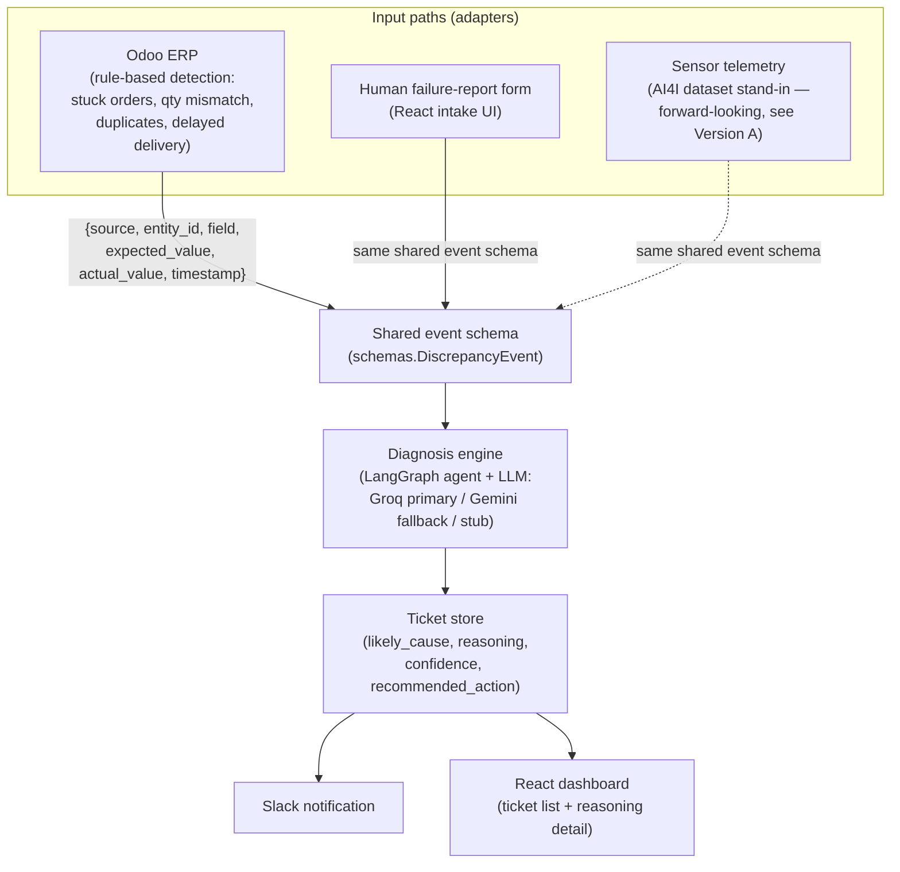
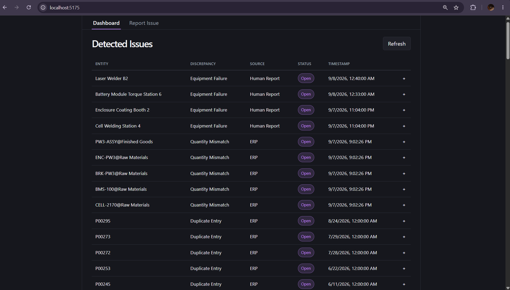
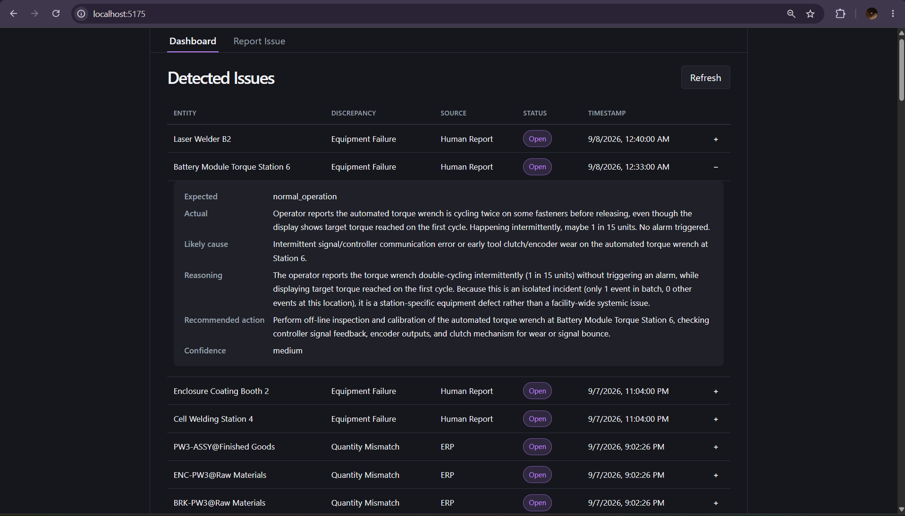
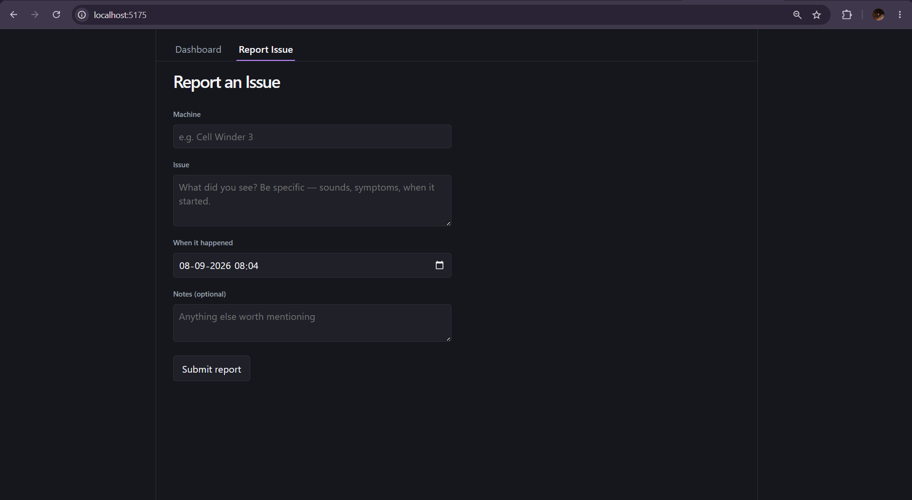

# ERP Reconciliation & Failure-Reporting Agent

An agent that watches an ERP for operational discrepancies — stuck orders, inventory drift,
duplicate records — diagnoses the likely cause, and turns it into a structured, notified
ticket. A shared diagnose-and-ticket engine also powers a second path: a human on the floor
reports an equipment failure through a simple form, and the same engine checks it against
historical incidents, drafts a report, and notifies the team over Slack.

**Why this exists:** this is a portfolio project built to support a referral pitch for a
Forward Deployed Engineer role on Tesla Energy's team at the Brookshire, TX plant. That
context — the role, the plant, the team — is stated here because it's what shaped every
design decision in this repo (see "What's simulated vs. real" below), **not** because Tesla
is involved in, endorses, or has reviewed this project in any way. It's an independent build
meant to demonstrate relevant engineering, not an official or sponsored artifact.

---

## Architecture

The core architectural claim of this project: **one shared engine, driven by interchangeable
adapters.** Each input source (ERP, human report, and — as a stretch — sensor telemetry)
normalizes into the same event shape before detection, diagnosis, ticketing, or notification
logic ever runs. None of that downstream logic is written per-source.



The dotted line for the sensor path is deliberate — it reuses the identical schema, agent,
and notification code, but needs its own `gather_context` implementation (sensor deviations
instead of ERP concepts like days-overdue), which is why it's marked as a separate,
forward-looking adapter rather than a fully equal third path today. See **Version A /
sensor roadmap** below.

---

## What's simulated vs. real

Stated plainly, because overstating this would undermine credibility the moment it came up
in conversation with anyone who looked closely:

**Real:**
- The Odoo Community Edition instance — actually self-hosted, actually running, via Docker.
- The Odoo API integration — the backend makes real authenticated calls against a real
  running Odoo instance (`backend/odoo_client.py`, `backend/odoo_fetch.py`), not a mock.
- The LLM diagnosis calls — real calls to Groq (primary) and Gemini (fallback) for every
  diagnosis, not canned responses (a deterministic stub exists only for tests and CI, where
  making real API calls would be flaky and slow).
- The Slack webhook integration — real notifications land in a real Slack channel.
- The React dashboard and failure-report form — a real, working frontend talking to the
  real backend API, not a static mock.

**Simulated:**
- **All the ERP data itself.** Every product, supplier, purchase order, work order, and
  stock movement is synthetic — generated by `data-gen/generate.py` (Faker + numpy) and
  pushed into Odoo through its own API, then a separate anomaly-injection pass
  (`data-gen/anomalies.py`) deliberately introduces the four anomaly types this project
  detects, logging ground truth separately (`data-gen/output/ground_truth.json`) so the eval
  numbers below are checkable, not estimated. No real Tesla data exists in or was used by
  this project anywhere.
- **The sensor telemetry (Version A).** Tesla has no sensors on plant equipment today (per a
  friend on the team, ~8 days in at the time this was scoped) — the AI4I 2020 Predictive
  Maintenance Dataset (public, UCI ML Repository) stands in for what real sensor data would
  look like. This is explicitly a forward-looking stretch piece, not a claim that this
  solves a problem Tesla has right now — see the dedicated section below.

---

## Setup

### Prerequisites

- Docker Desktop with the WSL2 backend enabled (Windows) or native Docker (Linux/Mac)
- Python 3.12, Node 24 — only needed if you want to run backend/frontend outside Docker

### Environment variables

Copy each example file and fill in real values — **never commit the filled-in versions**
(all three are gitignored):

| File to copy | Used by | Keys |
|---|---|---|
| `backend/.env.example` → `backend/.env` | Backend (Odoo API, LLM providers, Slack) | `ODOO_URL`, `ODOO_DB`, `ODOO_USERNAME`, `ODOO_API_KEY`, `GEMINI_API_KEY`, `GROQ_API_KEY`, `SLACK_WEBHOOK_URL` |
| `data-gen/.env.example` → `data-gen/.env` | Synthetic data generator (same Odoo instance as backend) | `ODOO_URL`, `ODOO_DB`, `ODOO_USERNAME`, `ODOO_API_KEY` |
| `frontend/.env.local.example` → `frontend/.env.local` | Frontend dev server only (not needed for the Docker build) | `VITE_BACKEND_PORT` |

`GEMINI_API_KEY` and `GROQ_API_KEY` are both optional individually — the backend falls back
through Groq → Gemini → a deterministic stub LLM depending on which keys are present and
which provider is actually answering at call time (see `backend/llm_client.py`). With no
keys at all, the pipeline still runs end-to-end on the stub, just without real reasoning.

> **Note on `backend/.env.example`:** at the time of writing this file doesn't yet exist in
> the repo (only `backend/.env`, gitignored, does) — create it from the key list above before
> a fresh clone can follow these steps. This is a real gap, not an oversight to gloss over.

### First-time Odoo entity setup

The base ERP entities (5 products, a BOM, 3 suppliers, 3 warehouse locations) were created
**manually** in the Odoo UI, not scripted — see `ODOO_setup.md` for the exact step-by-step
walkthrough. This is a one-time, ~30-45 minute manual process; the synthetic data generator
assumes these entities already exist by the exact names in that doc before it can seed
orders and stock movements against them.

### Bring the stack up

```bash
docker compose up -d
```

This starts Postgres, Odoo (`localhost:8069`), the backend (`localhost:8000` inside the
compose network), and the frontend (`localhost:5175`). The backend waits on Odoo's
healthcheck before starting, since it connects to Odoo at import time with no lazy-retry.

> **Known wrinkle:** the top-level `docker-compose.yml` references Odoo's Postgres/web
> volumes as `external: true` (`odoo_odoo-db-data`, `odoo_odoo-web-data`) — named after a
> since-removed `odoo/docker-compose.yml` that originally created them. On a genuinely fresh
> clone (no prior `odoo/` compose project ever run on the machine), those volumes won't
> exist yet and `docker compose up` will fail until they're created once, e.g.:
> `docker volume create odoo_odoo-db-data && docker volume create odoo_odoo-web-data`.
> This wasn't hit during this project's own development because those volumes already
> existed locally from Day 1 — worth fixing (either drop `external: true` or document the
> `docker volume create` step properly) before handing this repo to someone else to run cold.

To seed synthetic data after Odoo entities exist (see above):

```bash
cd data-gen && pip install -r requirements.txt
python generate.py      # baseline orders/stock movement over a simulated period
python anomalies.py     # inject the 4 anomaly types, logs ground_truth.json
```

### Running without Docker (backend/frontend dev loop)

```bash
cd backend && python3 -m venv venv && ./venv/bin/pip install -r requirements.txt
./venv/bin/uvicorn main:app --reload --port 8000

cd frontend && npm install && npm run dev
```

---

## Final eval numbers

Pulled directly from `FINAL_EVAL_NUMBERS.md` — every number below traces back to a
committed eval-output file, not an estimate. See that file for the full staleness-check
writeup (confirming none of these numbers were affected by a later LLM-provider switch).

### ERP-path anomaly detection (rule-based)

Source: `backend/eval_results.json`, produced by `backend/eval.py` against
`data-gen/output/ground_truth.json` (reference date `2026-09-07`). Deterministic — no
seed needed, pure rule matching.

| Anomaly type | TP | FP | FN | Precision | Recall |
|---|---|---|---|---|---|
| stuck_order | 28 | 0 | 0 | 100.0% | 100.0% |
| delayed_delivery | 13 | 0 | 0 | 100.0% | 100.0% |
| duplicate_entry | 10 | 1 | 0 | 90.9% | 100.0% |
| quantity_mismatch | 5 | 0 | 0 | 100.0% | 100.0% |
| **Overall** | **56** | **1** | **0** | **98.2%** | **100.0%** |

The one false positive (`P00272`, flagged as a duplicate of `P00046`) is a real, inspectable
case logged in full in `eval_results.json` — not hidden from this count.

### Sensor-path anomaly detection (Version A, AI4I dataset)

Source: `data-gen/sensor/sensor_detection_eval.json`, evaluated over the full 10,000-row
AI4I dataset (`data-gen/sensor/data_summary.json`: 339 real failures, a ~3.4% positive
rate). Three detector versions exist; **v2 is the one to cite** — it's the only one that met
this project's own trust condition (a genuine improvement in *both* precision and recall
over v1.5, not one traded for the other).

| Version | Precision | Recall | Accuracy | Scope |
|---|---|---|---|---|
| v1 (5 raw sensor columns, per-column z-score) | 66.7% | 19.5% | 96.9% | Full dataset (10,000 rows) |
| v1.5 (+ 3 derived features) | 75.0% | 29.2% | 97.3% | Full dataset (10,000 rows) |
| **v2 (Random Forest, `class_weight='balanced'`, threshold=0.6, seed=42)** | **79.2%** | **83.8%** | **98.7%** | **Held-out test split only** (68 positives / 1932 negatives) |

**Scope caveat — don't compare these as apples-to-apples:** v1/v1.5 are measured over the
full 10,000-row dataset; v2's numbers are from its held-out test split only (the
methodologically correct way to report a trained classifier, since that's the only portion
never touched during threshold tuning). They're deliberately different denominators.

v2's per-failure-type recall on the test split — preserved here rather than averaged away,
because it's the real trade-off the project made: TWF 14.3% (1/7), **HDF 100% (26/26)**, PWF
86.7% (13/15), OSF 90% (18/20), RNF 0% (0/5). See **Known limitations** below for why TWF/RNF
stay weak and why that's expected, not a bug.

### Diagnosis-agent accuracy (sampled)

Source: `v_diagnosis_agent_eval` in `data-gen/sensor/sensor_detection_eval.json`, produced
by `backend/eval_diagnosis_sensor.py`.

- **True positive pool:** 57 rows — v2's flags on the held-out test split that are real
  failures.
- **Sample:** fixed-seed random sample of 50 of those 57 (`seed = 42`).
- **Result: 25 of 50 correct — 50.0% accuracy.** Provider: Groq (Gemini was probed first and
  returned a 503 at the time). 0 errored, 0 fell back to the stub — this number isn't
  diluted by fallback noise.

| Failure type | In sample | Correct | Accuracy |
|---|---|---|---|
| HDF | 25 | 3 | 12% |
| PWF | 11 | 11 | 100% |
| OSF | 13 | 10 | 76.9% |
| TWF | 1 | 1 | n=1, not meaningful |
| RNF | 0 | 0 | n=0, not meaningful |

**Why this is still a meaningful number, not just a weak one:** HDF makes up half the
sample precisely *because* v2 now catches ~100% of real HDF cases — the 50% aggregate is a
direct, mechanical consequence of the detector's own win on HDF, not an unrelated
coincidence. PWF and OSF — the two failure types the derived features were purpose-built to
catch — are diagnosed correctly essentially every time. The honest headline is **"strong
detection, weak HDF diagnosis explanation,"** not "the agent is a coin flip." See **Known
limitations** for the leading hypothesis on why HDF specifically is hard to explain in text.

---

## Version A / sensor roadmap (forward-looking)

Tesla has no sensors on plant equipment today — all failure detection currently happens by a
person physically noticing a problem and reporting it (which is exactly what the human
failure-report path above already replaces). Version A is explicitly **not** a claim that
this solves a problem Tesla has right now. It exists to show the same engine is
**ready to retrain on real sensor parameters the moment sensors exist** — the shared event
schema, the diagnosis agent, and the notification path are identical to Version B; only the
`gather_context` step and the adapter are sensor-specific
(`backend/sensor_adapter.py`, `backend/gather_context_sensor.py`).

The AI4I 2020 Predictive Maintenance Dataset (industrial machine sensors — torque,
rotational speed, tool wear, temperature) stands in for real telemetry, chosen specifically
because it reads as general industrial equipment rather than, say, jet engines, which fits a
battery-plant pitch far better than the more common NASA CMAPSS dataset would.

---

## Known limitations

Stated here directly, not scattered across files or left for someone else to discover:

- **Single-sensor-threshold detectors (v1/v1.5) structurally miss combination-driven
  failures.** AI4I's own failure modes are partly defined by *combinations* of sensors
  (e.g. HDF ties temperature differential to rotational speed together) — a detector that
  thresholds each column independently can't catch that no matter how well each threshold is
  tuned. This is exactly why v2 (a classifier that learns joint, nonlinear interactions) was
  built, and why the v1/v1.5 numbers above are kept rather than deleted — the improvement it
  bought is part of the honest story.
- **TWF (tool wear failure) and RNF (random failure) stay weak by design, not by bug.** TWF:
  AI4I assigns each simulated tool a randomly-drawn wear limit (200-240 min) rather than a
  fixed physical threshold, so population-level deviation doesn't reliably line up with any
  one tool's actual limit. RNF: defined in the dataset as near-unpredictable regardless of
  sensor readings — no detector built on sensor thresholds is expected to reliably catch it.
- **HDF diagnosis accuracy is a real, open weak spot** (3/25 correct in the sampled eval).
  Leading, not-yet-verified hypothesis: HDF's real trigger is a joint pattern (temperature
  differential *and* rotational speed together), each individually modest, and the
  description layer handed to the diagnosis agent may rank/truncate those two signals out of
  the top few it surfaces per row. Detection catches HDF fine (the ML model reasons over all
  8 signals jointly) — explaining *why* in text to an LLM is the part that's currently weak.
  Parked, not actively being investigated further, per this project's own prioritization
  (core paths over stretch polish).
- **Gemini 503s aren't gracefully absorbed everywhere yet.** The ERP/Version B diagnosis path
  has a broad, any-failure fallback chain (Groq → Gemini → stub) as of the most recent fix;
  this was specifically closed after a reproduced Gemini 503 propagated as an unhandled 500
  under the older, quota-only fallback logic.
- **No auth on backend endpoints yet** (API key/JWT was planned as P1 in the build plan but
  not completed) — this is a demo-scale gap, not something that should be read as an
  oversight about production-readiness expectations.
- **`backend/.env.example` doesn't exist yet** in the repo (see Setup above) — a real gap for
  anyone trying to clone and run this cold.

---

## Repo layout

- `odoo/` — Odoo addons directory (the compose file that originally lived here was removed;
  Odoo is now started from the top-level `docker-compose.yml`)
- `backend/` — FastAPI service: Odoo fetch layer, rule-based detection, LangGraph diagnosis
  agent, failure-report intake, sensor adapter/evals, ticket store
- `frontend/` — React dashboard + failure-report intake form
- `data-gen/` — synthetic ERP data generator, anomaly injection, AI4I sensor dataset + evals
- `PLAN.md` — the day-by-day build plan this project followed
- `FINAL_EVAL_NUMBERS.md` — full sourcing detail behind every number quoted above
- `sensor_detection_version_a.md` — the detailed Version A spec (dataset, detector
  iterations, eval methodology)
- `ODOO_setup.md` — manual Odoo entity setup walkthrough
- `data-gen/GROUND_TRUTH_NOTES.md` — the story of a real ground-truth regression caught and
  fixed during final QA (13 → 56 events), kept as-is rather than cleaned up after the fact

## Stack

- **ERP:** Odoo Community Edition, self-hosted via Docker (Postgres-backed)
- **Backend:** Python, FastAPI
- **Diagnosis/agent logic:** LangGraph, Groq (primary) / Gemini (fallback) / deterministic stub
- **Frontend:** React (Vite)
- **Containerization:** Docker / docker-compose
- **CI/CD:** GitHub Actions (lint, test, build)

---

## Screenshots

<!-- TODO: paste screenshot here -->


<!-- TODO: paste screenshot here -->


<!-- TODO: paste screenshot here -->

